# pydcache
Collections of dCache python utilities

## scripts/cta_nanny.py

Long-running “nanny” that consumes CTA taped/ingest logs from Kafka, detects specific duplicate-key failures, and enqueues PNFSIDs for worker processes that repair/update Chimera metadata and trigger dCache admin actions.

### Flow (overview)

### Flow (worker per PNFSID)

